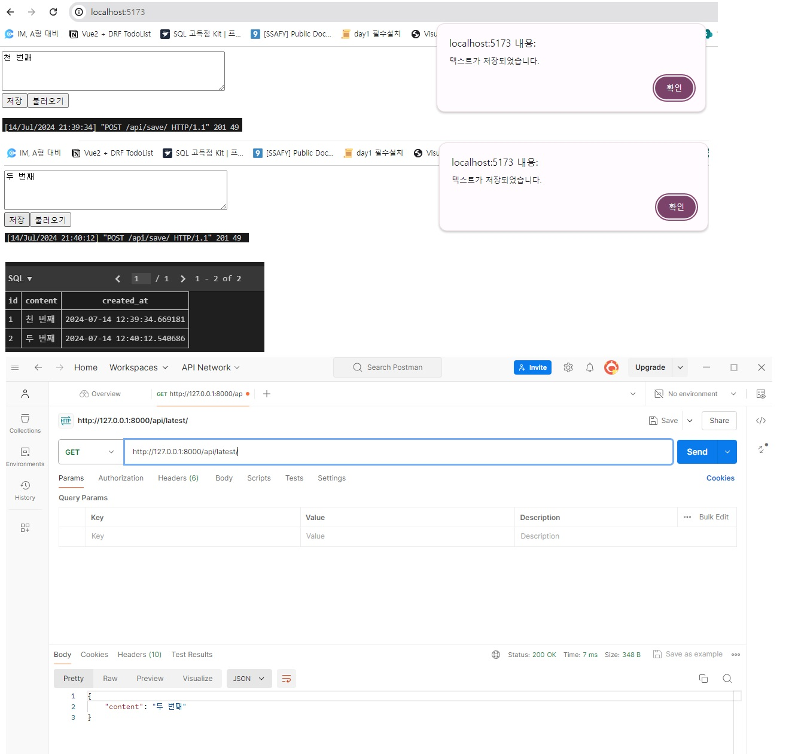

# 텍스트 저장 및 불러오기 프로젝트

Vue.js 프론트엔드와 Django 백엔드를 사용한 간단한 텍스트 저장 및 불러오기 프로젝트

## 기능

- 텍스트 박스에 내용 입력
- '저장' 버튼 클릭 시 입력한 텍스트를 Django DB에 저장
- '불러오기' 버튼 클릭 시 가장 최근에 저장한 텍스트를 불러와 표시
- 백엔드 API를 통해 저장 및 불러오기 기능 수행

## 사용 방법

1. 프로젝트 클론
2. 백엔드 설정:
3. 프론트엔드 설정:
4. 브라우저에서 `http://localhost:8080/` 접속
5. 텍스트 입력 후 "저장" 버튼 클릭
6. "불러오기" 버튼 클릭하여 저장된 텍스트 확인

## API 테스트

Postman을 사용하여 API를 직접 테스트할 수 있다.

- POST 요청 (텍스트 저장):
 - URL: `http://localhost:8000/api/save/`
 - Body (raw JSON):
   ```json
   {
       "content": "테스트 텍스트입니다."
   }
   ```

- GET 요청 (최신 텍스트 불러오기):
 - URL: `http://localhost:8000/api/latest/`


## 스크린샷
